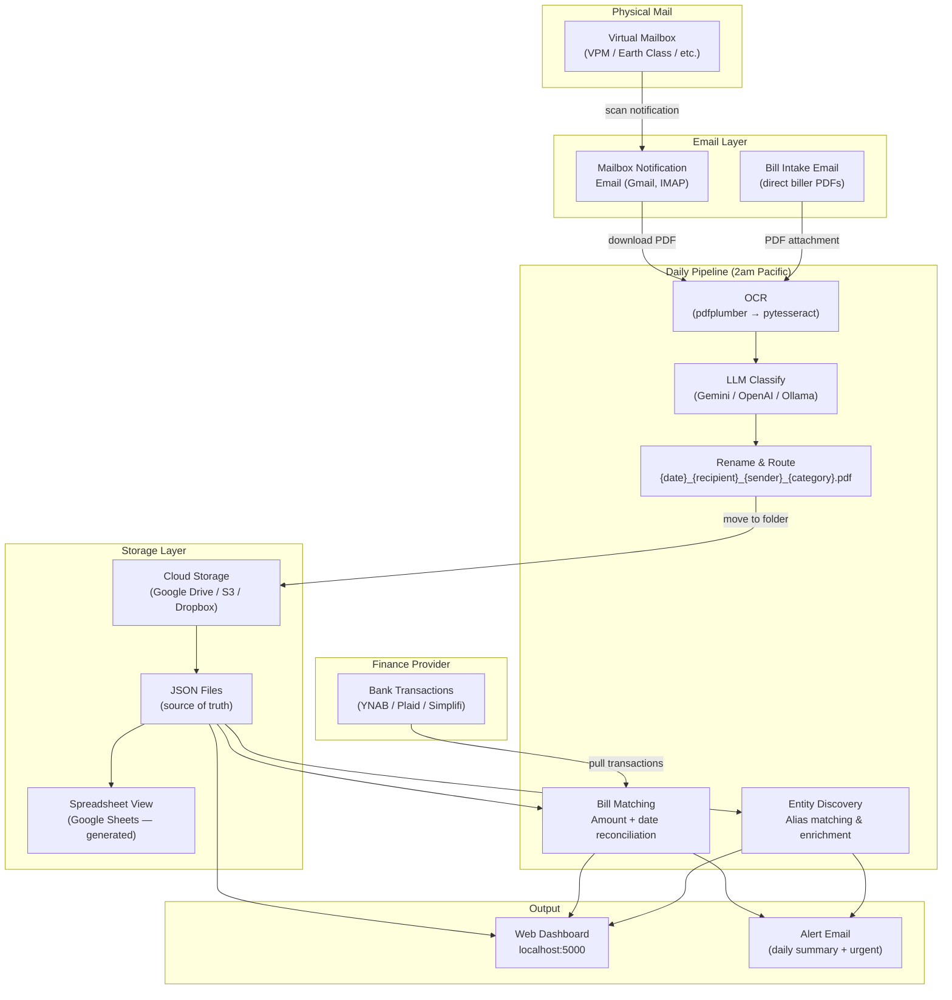

# PostMule — System Architecture

PostMule is built around a **provider/adapter pattern**: every external service is abstracted behind an interface, so you can swap any component with a single line in `config.yaml`.



## Components

| Component | Default | Purpose |
|---|---|---|
| Virtual Mailbox | VirtualPostMail | Scans physical mail; sends notification email |
| Email (notifications) | Gmail | Receives VPM scan emails; triggers PDF download |
| Email (bill intake) | Gmail | Receives biller PDF attachments directly |
| OCR | pdfplumber + pytesseract | Extracts text from PDFs; auto-selects best method |
| LLM | Gemini 1.5 Flash | Classifies documents, extracts structured fields |
| Storage | Google Drive | Stores PDFs and JSON data files (cloud-redundant) |
| Spreadsheet | Google Sheets | Generated view layer; rebuilt from JSON on demand |
| Finance | YNAB | Pulls bank transactions for bill reconciliation |
| Web Dashboard | Flask + HTMX + Alpine.js | Local browser UI (localhost:5000) |
| Notifications | Email | Daily summary + urgent alerts |

## Data Flow Principles

- **JSON files are the source of truth.** Sheets, the dashboard, and all exports are derived views.
- **Soft deletes only.** No file is permanently deleted automatically.
- **3-layer write redundancy.** Every Drive write: execute → MD5 verify → audit log.
- **Provider interfaces.** All external services implement a base protocol in `postmule/providers/*/base.py`. Swap any provider with one config line.
- **Dry-run everywhere.** The `--dry-run` flag is respected by every agent and every provider — no writes, moves, or sends occur in dry-run mode.
- **API safety gate.** LLM API usage limits (configured under `api_safety` in `config.yaml`) are checked before every LLM call. Calls are blocked if limits would be exceeded.
- **50-file cap per run.** No more than 50 files are moved out of Inbox in a single pipeline run, regardless of how many are present.

## Key File Paths

```
PostMule/                          ← Cloud storage root (configurable)
├── _System/data/                  ← JSON files, encrypted credential backup
│   ├── entities.json
│   ├── bills.json
│   ├── notices.json
│   ├── forward_to_me.json
│   └── pending/
│       ├── entity_matches.json
│       └── bill_matches.json
├── Inbox/                         ← Unprocessed incoming PDFs
├── Bills/                         ← Classified bills
├── Notices/
├── ForwardToMe/
├── Personal/
├── Junk/
├── NeedsReview/
├── Duplicates/
└── Archive/
```
