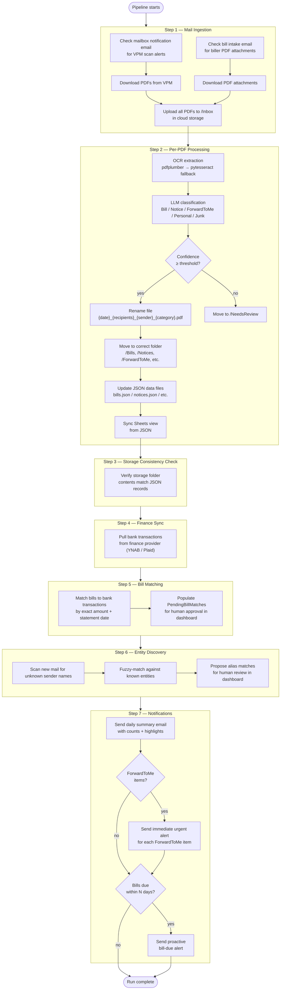

# PostMule — Daily Workflow

The daily pipeline runs automatically on a configurable schedule (default: 2:00 AM local time, set via `config.yaml` → `schedule.run_time`). Here is everything that happens in one run.

## Pipeline Flowchart



## Step Details

### Step 1 — Mail Ingestion
Two parallel ingestion paths feed the same downstream pipeline:

1. **Physical mail (VPM path):** PostMule monitors a Gmail inbox for scan notification emails from your virtual mailbox provider. When found, it downloads the PDF scans and uploads them to `/Inbox` in cloud storage.
2. **Email bill intake:** A separate inbox monitors for biller-sent PDF attachments (e.g. AT&T, utilities emailing your bill directly). PDFs are downloaded and uploaded to the same `/Inbox`.

### Step 2 — Per-PDF Processing
For each PDF in `/Inbox`:

1. **OCR** — `pdfplumber` extracts the text layer first (fast, accurate for digital PDFs). If no usable text is found, `pytesseract` OCRs the rendered image.
2. **LLM classification** — The extracted text is sent to the configured LLM with a structured prompt. The LLM returns: category, sender name, recipients, amount (for bills), due date (for bills), and a summary.
3. **Confidence gate** — If classification confidence is below `classification_confidence_threshold` (default 0.80), the file goes to `/NeedsReview` instead of being classified.
4. **Rename & move** — The file is renamed to `{date}_{recipients}_{sender}_{category}.pdf` and moved to the correct folder.
5. **JSON update** — The relevant JSON data file (`bills.json`, `notices.json`, etc.) is updated with the extracted fields.
6. **Sheets sync** — The corresponding Google Sheet tab is regenerated from the JSON.

### Step 3 — Storage Consistency Check
PostMule verifies that files in cloud storage folders match the records in JSON. Discrepancies are flagged in the run log.

### Step 4 — Finance Sync
Pulls recent bank transactions from the configured finance provider (YNAB, Plaid, etc.) and writes them to `bank_transactions.json`.

### Step 5 — Bill Matching
Attempts to match each unmatched bill to a bank transaction using:
- **Exact dollar amount** (configurable tolerance, default 0 cents)
- **Statement date** (exact match)

Note: Company name is deliberately excluded — finance providers normalize transaction names in ways that don't match biller names.

Matches are written to `pending/bill_matches.json` and shown in the dashboard for manual approval. When approved, PostMule updates the finance provider transaction name.

### Step 6 — Entity Discovery
Scans new mail items for sender names not yet in the entity database. Runs fuzzy string matching against all known entity names and aliases. Matches above `fuzzy_match_threshold` (default 0.85) are added to `pending/entity_matches.json` for review in the dashboard.

### Step 7 — Notifications
- **Daily summary email** — always sent; summarizes mail counts, new bills, matched transactions, and pending items.
- **Urgent ForwardToMe alert** — sent immediately if any physical mail was classified as ForwardToMe (configurable: `forward_to_me_urgent`).
- **Bill due alert** — sent if any bill is due within `bill_due_alert_days` (default 7).

## File Naming Convention

```
{date}_{recipients}_{sender}_{category}.pdf

Examples:
  2025-11-15_Alice_ATT_Bill.pdf
  2025-12-01_Alice-Bob_IRS_Notice.pdf
  2026-01-03_Alice_Verizon_Bill.pdf
```
